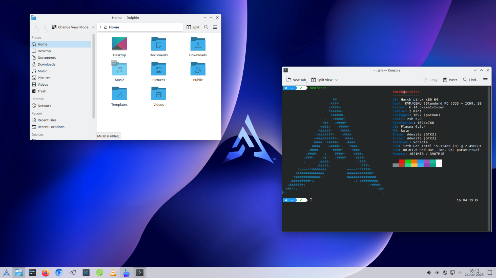

<!-- About Section -->
 # About Harch Linux
 

 
  
* [Download Link](https://github.com/harchlinux/harch-gnome-pro/releases)
 
 
 

### What is Gnome Desktop?

GNOME is a user-friendly and modern desktop environment that provides a seamless and intuitive user experience. It is designed with simplicity, accessibility, and customization in mind. GNOME offers a wide range of features and applications, including a file manager, a web browser, a text editor, and a variety of productivity tools.

### Pre-Installed Applications

| Name                      | Usage                                             | Category        |
|---------------------------|---------------------------------------------------|----------------|
| telegram-desktop         | A desktop client for Telegram messaging.         | Social        |
| firefox                 | Fast, Private & Safe Web Browser.                 | Web Browser   |
| ark                     | A file archiver and extractor.                    | Utility       |
| mousepad                | A simple and fast text editor.                    | Productivity  |
| code                    | A lightweight code editor (VS Code).              | Development   |
| chromium                | Open-source web browser.                          | Web Browser   |
| vlc                     | A powerful multimedia player.                     | Movie & Music |
| obs-studio              | Open-source software for video recording & streaming. | Media        |
| g4music                 | A simple and easy-to-use music player.            | Movie & Music |

